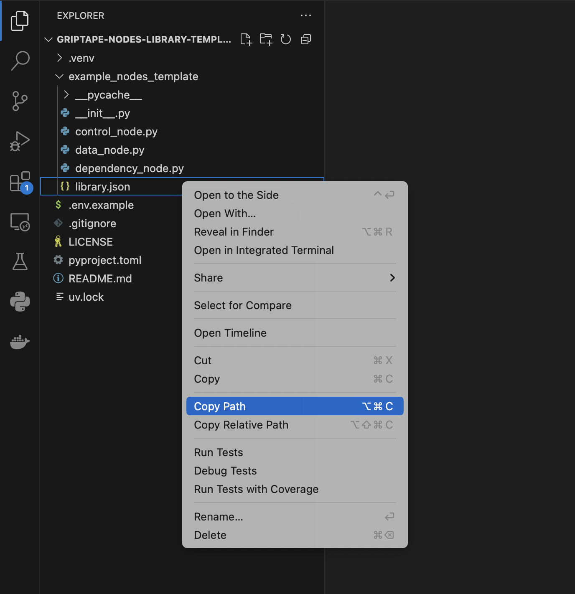

# Deadline Cloud Nodes Library

This library provides Griptape Nodes for interacting with AWS Deadline Cloud APIs and services.

**IMPORTANT:** To use these nodes, you will need AWS Credentials.

To configure your settings within the Griptape Nodes IDE:

1. Open the **Settings** menu.
1. Navigate to the **Engine Settings** panel.
1. Configure your:
   1. Farm ID
   1. Queue ID
   1. Monitor URL
   1. Region name
   1. Profile name

## Add your library to your installed Engine

If you haven't already installed your Griptape Nodes engine, follow the installation steps from the [griptape-nodes README](https://github.com/griptape-ai/griptape-nodes).
After you've completed those and you have your engine up and running:

1. Copy the path to your `library.json`. Right click on the file, and `Copy Path` (Not `Copy Relative Path`)
   
1. Start up the engine!
1. Navigate to settings
   
1. Open your settings and go to the App Events tab. Add an item in **Libraries to Register**
   
1. Paste your copied `library.json` path from earlier into the new item
   
1. Exit out of Settings. It will save automatically!
1. Open up the **Libraries** dropdown on the left sidebar
   
1. Your newly registered library should appear! Drag and drop nodes to use them!
   
