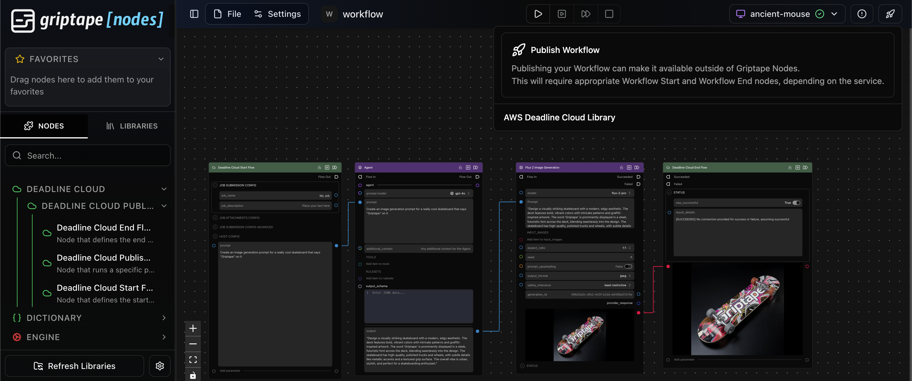
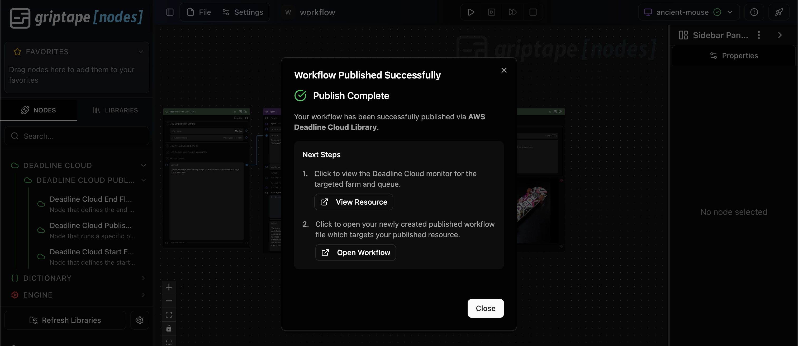
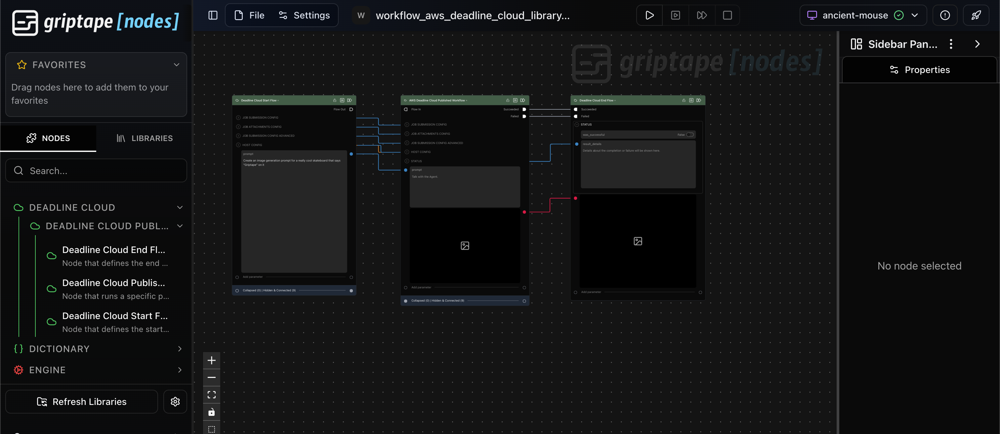
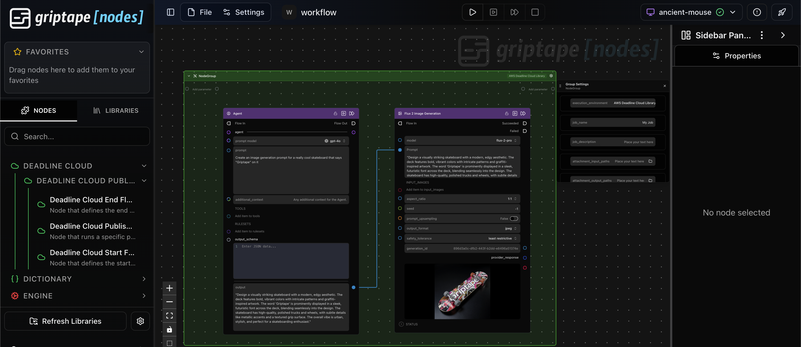

# Deadline Cloud Nodes Library

This library provides Griptape Nodes for interacting with AWS Deadline Cloud APIs and services.

**IMPORTANT:** To use these nodes, you will need AWS Credentials with access to submit Jobs to a Deadline Cloud Farm.

## Prerequisites

1. Ensure you have an AWS Deadline Cloud Farm available. Follow the [AWS documentation](https://docs.aws.amazon.com/deadline-cloud/latest/userguide/getting-started.html) to get started.
1. Ensure you have AWS Credentials available to submit Jobs to the Farm.
   1. This can be achieved by installing the [Deadline Cloud monitor](https://docs.aws.amazon.com/deadline-cloud/latest/userguide/submitter.html#install-deadline-cloud-monitor) and logging in.

## Add your library to your installed Engine

## Configuration

To configure your settings within the Griptape Nodes IDE:

1. Open the **Settings** menu.
1. Navigate to the **Library Settings** panel.
1. Configure your:
   1. Default Farm ID
   1. Default Queue ID
   1. Monitor URL
   1. Region name
   1. Profile name
   1. Default Storage profile ID (optional)

## Usage

After configuring your Deadline Cloud settings and defaults, you can execute Griptape Nodes workflows on Deadline Cloud as Jobs.

### Publish Workflow

The first method for executing Griptape Nodes workflows on Deadline Cloud is to utilize the Publish Workflow setup. The steps are as follows:

1. Author a Workflow in the GUI Editor, using:
   1. A Deadline Cloud Start Flow node to expose the input Parameters to your Workflow
      1. Also specify any Deadline Cloud Job configuration you desire on this node
   1. A Deadline Cloud End Flow node to expose the output Parameters of your Workflow
1. Click the 'Publish' button in the top right of the Editor (rocket ship icon)
   1. Choose the `AWS Deadline Cloud Library` target for publishing to
   1. (Optional) Enter a name for the new workflow file which will be generated as a result of publishing
1. Open the newly generated workflow file in the Editor from the publish operation
1. Click the `Run Workflow` button in the Editor to run the published workflow on Deadline Cloud as a Job

This method is useful if you have a reusable workflow to run on Deadline Cloud, where you wish to reinvoke the workflow with varying input.

### Deadline Cloud Execution Group

The second method for executing Griptape Nodes workflows on Deadline Cloud is to utilize a Node Group configured for the Deadline Cloud execution environment. The steps are as follows:

1. Author a Workflow in the GUI Editor:
1. Select the Nodes of your workflow, and create a Group by:
   1. Right clicking, then select Create Group
   1. OR via the keyboard shortcut Cmd + G (Ctrl + G on Windows)
1. Click the settings cog icon on the top right of the Group header
1. Select the `execution_environment` of `AWS Deadline Cloud Library`
1. Configure the settings within the panel as you desire for Deadline Cloud execution (just like the `Deadline Cloud Start Flow` Node)

This method is useful if you have a workflow that would benefit from offloading certain Nodes to execute remotely on Deadline Cloud, and some Nodes that should run local on your machine.

### Templates

For some examples on using the AWS Deadline Cloud Library, check out the [templates](./griptape_nodes_library_deadline_cloud/workflows/templates)!
