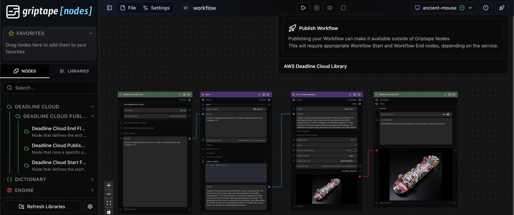
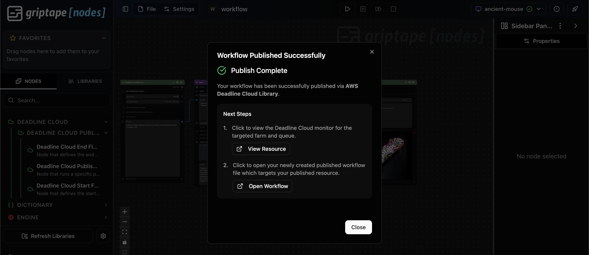
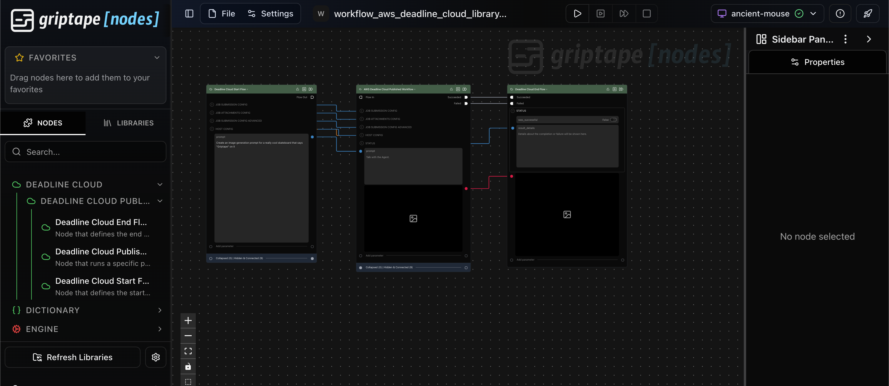
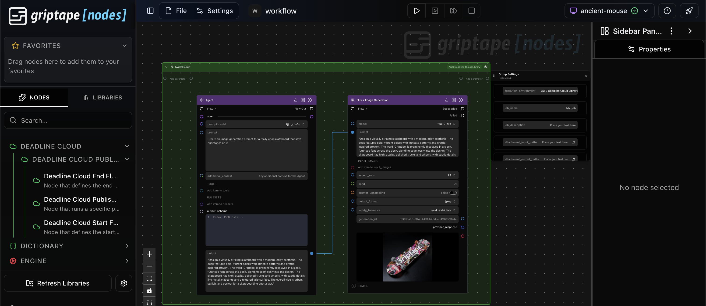

# Deadline Cloud Nodes Library

This library provides Griptape Nodes for interacting with AWS Deadline Cloud APIs and services.

**IMPORTANT:** To use these nodes, you will need AWS Credentials with access to submit Jobs to a Deadline Cloud Farm.

## Prerequisites

1. Ensure you have an AWS Deadline Cloud Farm available. Follow the [AWS documentation](https://docs.aws.amazon.com/deadline-cloud/latest/userguide/getting-started.html) to get started.
1. Ensure you have AWS Credentials available to submit Jobs to the Farm.
   1. This can be achieved by installing the [Deadline Cloud monitor](https://docs.aws.amazon.com/deadline-cloud/latest/userguide/submitter.html#install-deadline-cloud-monitor) and logging in.

## Add your library to your installed Engine

[](https://nodes.griptape.ai/#library-management?git=https://github.com/griptape-ai/griptape-nodes-library-deadline-cloud)

## Configuration

To configure your settings within the Griptape Nodes IDE:

1. Open the **Settings** menu.
1. Navigate to the **Library Settings** panel.
1. Configure your:
   1. Default Farm ID
   1. Default Queue ID
   1. Monitor URL
   1. Region name
   1. Profile name
   1. Default Storage profile ID (optional)

## Usage

After configuring your Deadline Cloud settings and defaults, you can execute Griptape Nodes workflows on Deadline Cloud as Jobs.

### Publish Workflow

The first method for executing Griptape Nodes workflows on Deadline Cloud is to utilize the Publish Workflow setup. The steps are as follows:

1. Author a Workflow in the GUI Editor, using:
   1. A Deadline Cloud Start Flow node to expose the input Parameters to your Workflow
      1. Also specify any Deadline Cloud Job configuration you desire on this node
   1. A Deadline Cloud End Flow node to expose the output Parameters of your Workflow
1. Click the 'Publish' button in the top right of the Editor (rocket ship icon)
   1. Choose the `AWS Deadline Cloud Library` target for publishing to
   1. (Optional) Enter a name for the new workflow file which will be generated as a result of publishing
1. Open the newly generated workflow file in the Editor from the publish operation
1. Click the `Run Workflow` button in the Editor to run the published workflow on Deadline Cloud as a Job







This method is useful if you have a reusable workflow to run on Deadline Cloud, where you wish to reinvoke the workflow with varying input.

### Deadline Cloud Execution Group

The second method for executing Griptape Nodes workflows on Deadline Cloud is to utilize a Node Group configured for the Deadline Cloud execution environment. The steps are as follows:

1. Author a Workflow in the GUI Editor:
1. Select the Nodes of your workflow, and create a Group by:
   1. Right clicking, then select Create Group
   1. OR via the keyboard shortcut Cmd + G (Ctrl + G on Windows)
1. Click the settings cog icon on the top right of the Group header
1. Select the `execution_environment` of `AWS Deadline Cloud Library`
1. Configure the settings within the panel as you desire for Deadline Cloud execution (just like the `Deadline Cloud Start Flow` Node)



This method is useful if you have a workflow that would benefit from offloading certain Nodes to execute remotely on Deadline Cloud, and some Nodes that should run local on your machine.

### Templates

For some examples on using the AWS Deadline Cloud Library, check out the [templates](./griptape_nodes_library_deadline_cloud/workflows/templates)!

#### Train LoRA Template Prerequisites

The `deadline_cloud_train_lora` template has additional requirements beyond the standard Deadline Cloud setup:

**LoRA Training Library setup:**

1. Install the [Griptape Nodes LoRA Training Library](https://github.com/griptape-ai/griptape-nodes-lora-training-library) in your engine, registered with the `griptape-nodes-library-cuda129.json` file for Deadline Cloud GPU compatibility. See the [LoRA Training Library README](https://github.com/griptape-ai/griptape-nodes-lora-training-library#readme) for installation instructions.
2. Initialize the `sd-scripts` git submodule within the LoRA Training Library:
   ```bash
   cd <path-to-lora-training-library>
   git submodule update --init --recursive
   ```
   **Why:** The Train LoRA node invokes training scripts from [kohya-ss/sd-scripts](https://github.com/kohya-ss/sd-scripts), which are included as a git submodule. When the Deadline Cloud publisher packages your workflow, it copies the library directory into the job bundle. If the submodule is not initialized, the `sd-scripts/` directory will be empty and the worker will fail with `Script not found: .../sd-scripts/flux_train_network.py`.

**FLUX model download:**

1. Download the FLUX.1 model to your local HuggingFace cache:
   ```bash
   huggingface-cli download black-forest-labs/FLUX.1-schnell
   ```
   **Why:** The Deadline Cloud publisher detects HuggingFace models referenced by nodes and uploads them as job attachments. On the worker, the `HF_HUB_CACHE` environment variable is set to the remapped model directory so the Train LoRA node can locate the model files. If the model is not downloaded locally, the publisher cannot upload it and the worker will fail with `Model download required!`.

**Worker requirements:**

1. Your Deadline Cloud queue must have a worker fleet with **GPU-equipped instances** (the template requests 1-2 GPUs).
   **Why:** LoRA training uses `accelerate` with mixed-precision (bf16) and requires CUDA-capable GPUs to run the FLUX.1 training script.

## Troubleshooting

### "Failed to create Deadline Cloud client. Please ensure your AWS credentials are configured and refreshed."

This means the library cannot authenticate with AWS. To resolve:

1. **If using Deadline Cloud Monitor:** Open the Monitor app and ensure you are logged in. Credentials expire periodically and need to be refreshed.
2. **If using an AWS profile:** Verify the `Profile name` in Library Settings matches a valid profile in `~/.aws/config`. You can test with: `aws sts get-caller-identity --profile <your-profile-name>`
3. **If no credentials are configured:** Install the [Deadline Cloud Monitor](https://docs.aws.amazon.com/deadline-cloud/latest/userguide/submitter.html#install-deadline-cloud-monitor) and log in, or configure an AWS profile with `aws configure --profile <name>`.

