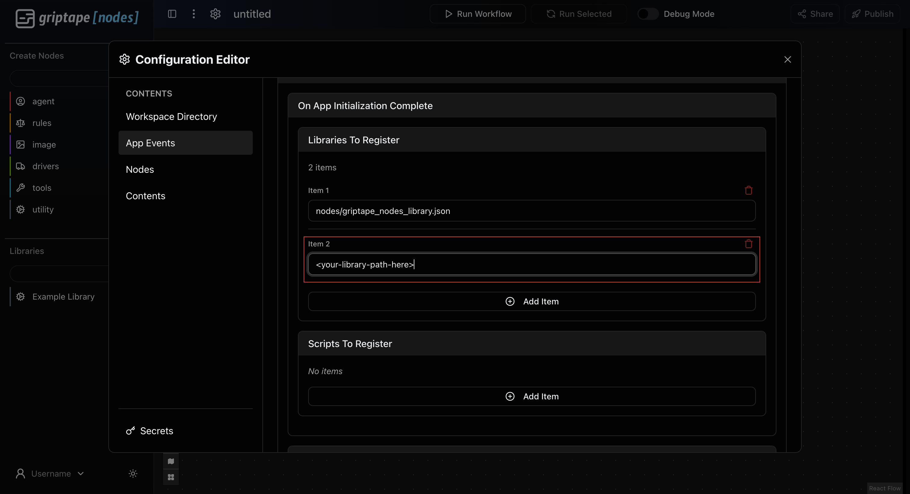
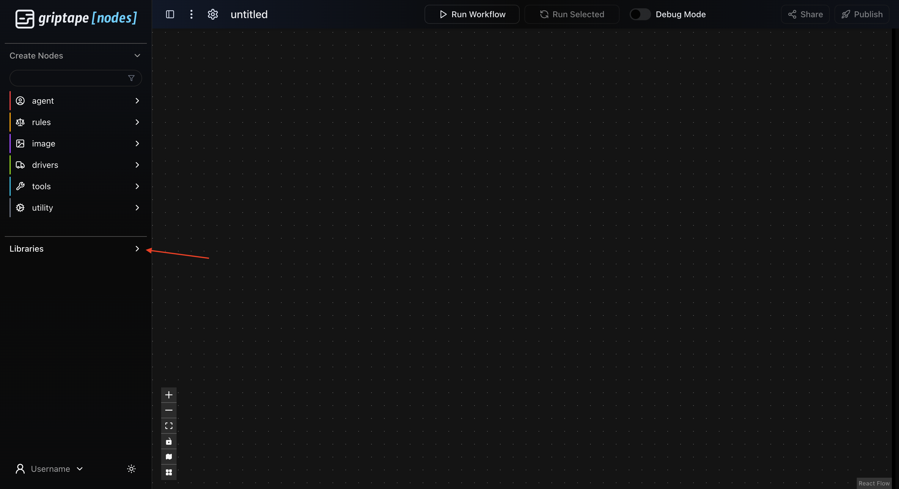
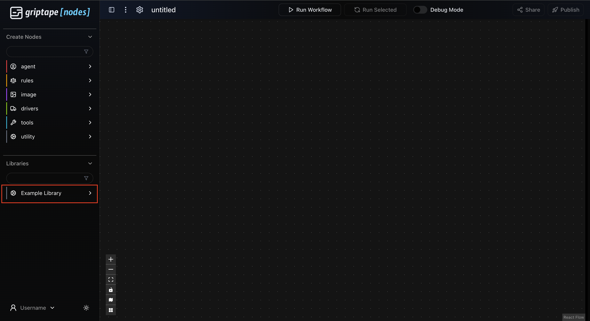

# Deadline Cloud Nodes Library

This library provides Griptape Nodes for interacting with AWS Deadline Cloud APIs and services.

**IMPORTANT:** To use these nodes, you will need AWS Credentials.

To configure your settings within the Griptape Nodes IDE:

1. Open the **Settings** menu.
1. Navigate to the **Engine Settings** panel.
1. Configure your:
   1. Default Farm ID
   1. Default Queue ID
   1. Monitor URL
   1. Region name
   1. Profile name
   1. Default Storage profile ID (optional)

## Add your library to your installed Engine

If you haven't already installed your Griptape Nodes engine, follow the installation steps from the [griptape-nodes README](https://github.com/griptape-ai/griptape-nodes).
After you've completed those and you have your engine up and running:

1. Copy the path to your `library.json`. Right click on the file, and `Copy Path` (Not `Copy Relative Path`)
   
1. Start up the engine!
1. Navigate to settings
   
1. Open your settings and go to the App Events tab. Add an item in **Libraries to Register**
   
1. Paste your copied `library.json` path from earlier into the new item
   
1. Exit out of Settings. It will save automatically!
1. Open up the **Libraries** dropdown on the left sidebar
   
1. Your newly registered library should appear! Drag and drop nodes to use them!
   

## Usage

After configuring your Deadline Cloud settings and defaults, you can publish workflows to Deadline Cloud:

1. Author a Workflow in the GUI Editor, using:
   1. A Deadline Cloud Start Flow node to expose the input Parameters to your Workflow
      1. Also specify any Deadline Cloud Job configuration you desire on this node
   1. A Deadline Cloud End Flow node to expose the output Parameters of your Workflow
1. Click the 'Publish' button in the top right of the Editor (rocket ship icon)
   1. Choose the AWS Deadline Cloud Library target for publishing to
   1. (Optional) Enter a name for the new workflow file which will be generated as a result of publishing
   1. (Optional) Unselect `Execute workflow immediately after publishing` if you wish to run the published workflow from the Editor
1. Open the newly generated workflow file in the Editor from the publish operation
1. Click the `Run Workflow` button in the Editor to run the published workflow on Deadline Cloud as a Job
